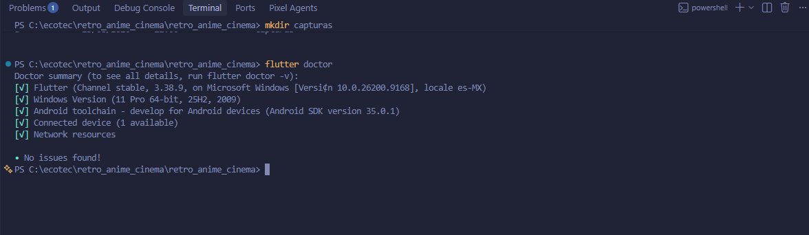
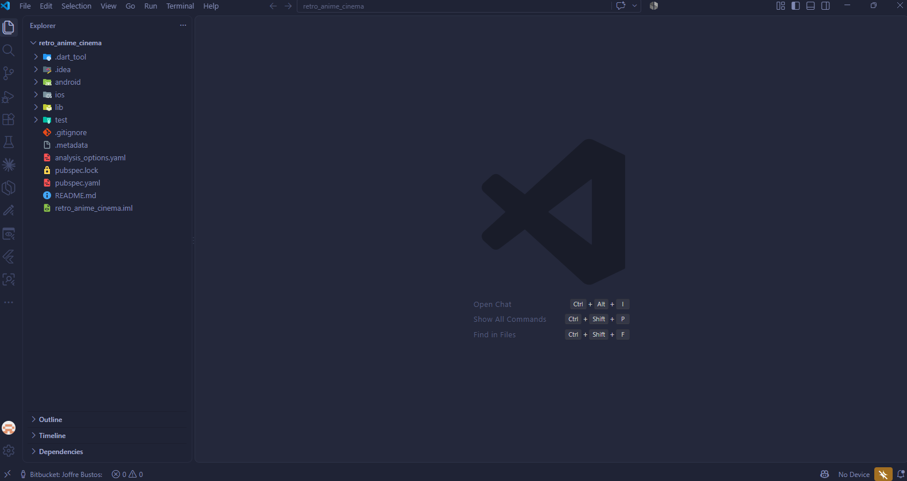
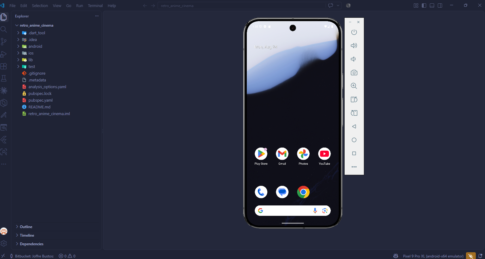
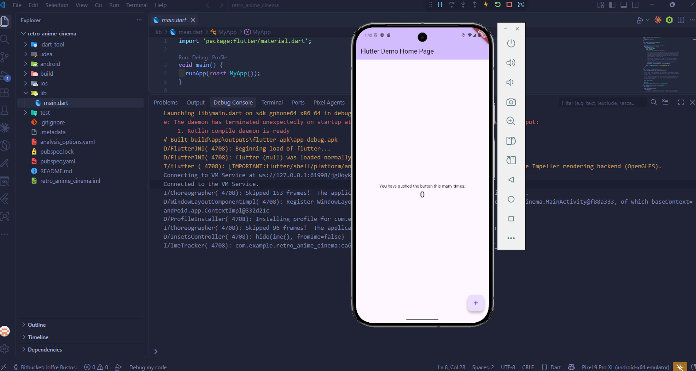
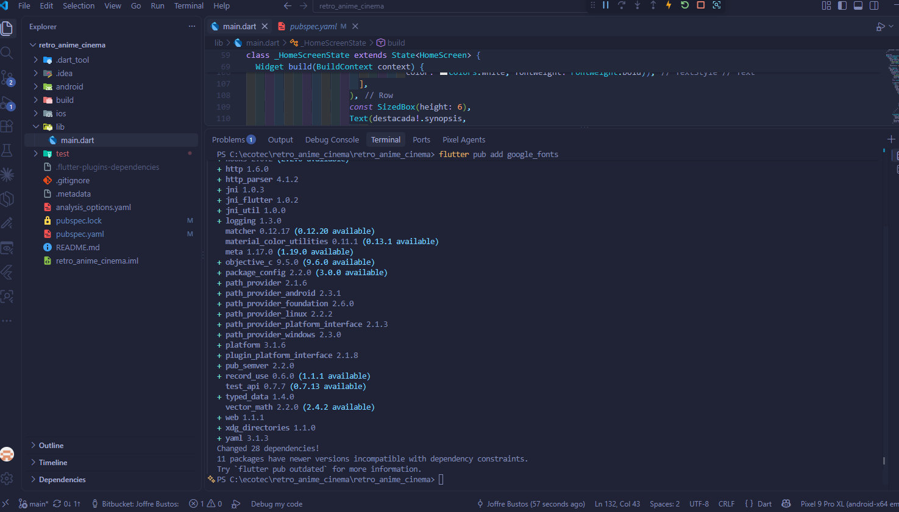
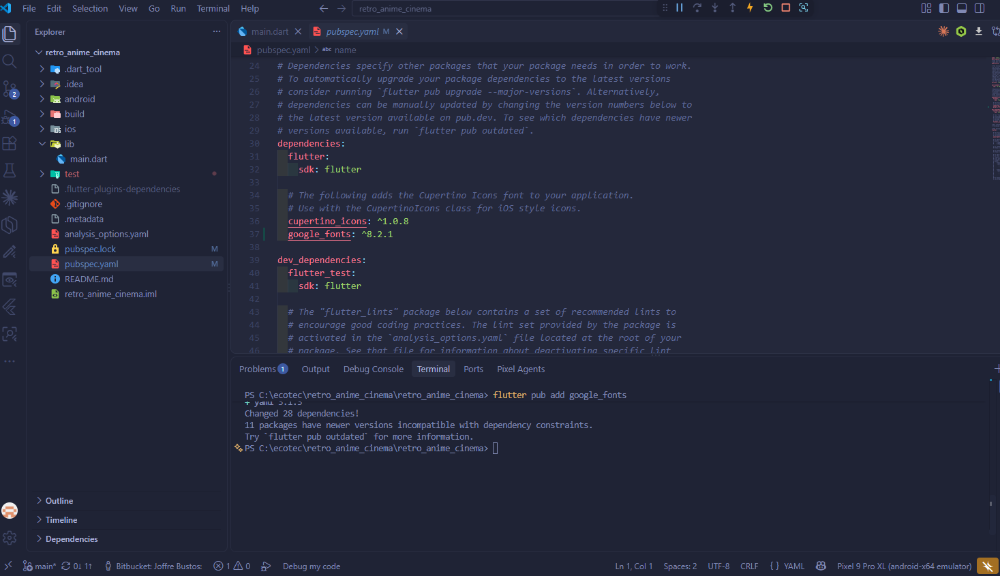
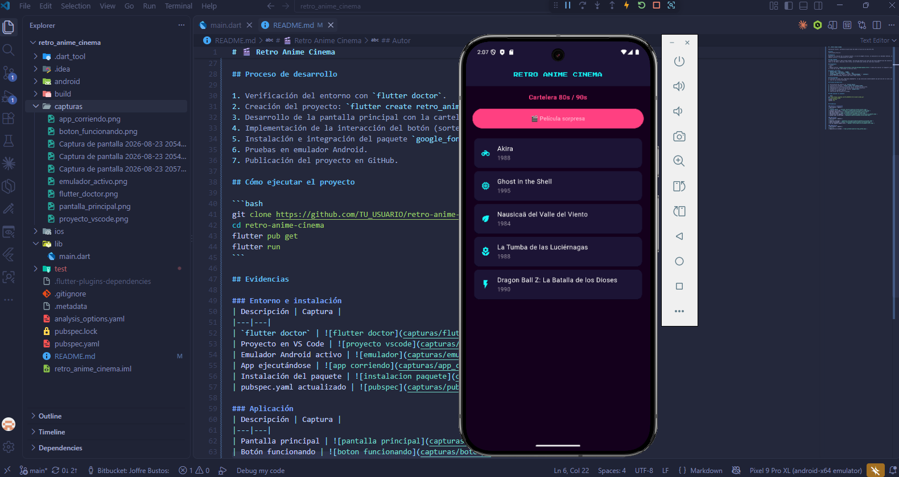
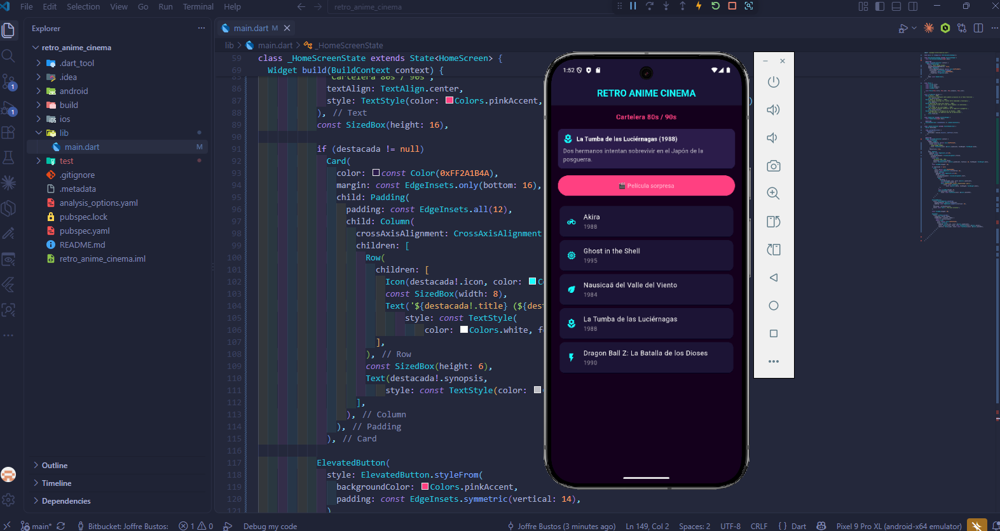
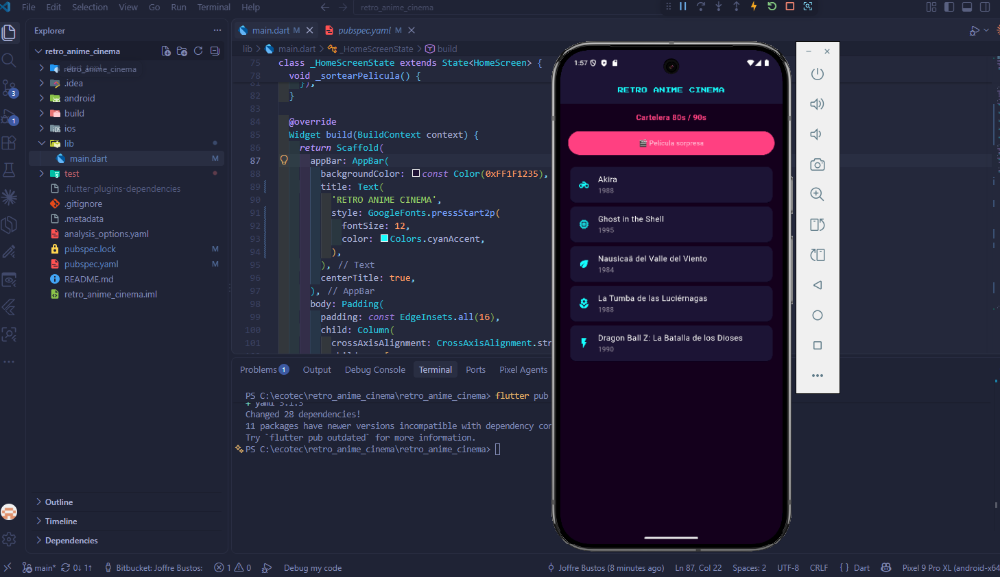

# 🎬 Retro Anime Cinema

Aplicación Flutter. Cartelera de películas de anime clásico de los años 80 y 90.

## Autor
Joffre Bustos Murillo

## Objetivo
Demostrar la creación de un proyecto Flutter, el uso de widgets básicos, la ejecución en un emulador Android, la integración de un paquete externo y la publicación en GitHub.

## Tema elegido
Cartelera de anime — "Retro Anime Cinema": una app que muestra una lista de películas emblemáticas del anime de los 80s/90s (Akira, Ghost in the Shell, Nausicaä, entre otras) con un botón que sortea una "película sorpresa".

## Tecnologías
- Flutter
- Dart
- Paquete externo: [google_fonts](https://pub.dev/packages/google_fonts) — usado para aplicar la tipografía pixelada "Press Start 2P" al título de la app, reforzando la estética retro.

## Widgets utilizados
- `MaterialApp`, `Scaffold`, `AppBar`
- `Column`, `ListView.builder`, `Card`, `Row`
- `ElevatedButton` con lógica de estado (`StatefulWidget` + `setState`)
- Colores personalizados (paleta neón sobre fondo oscuro)

## Funcionalidad
Al presionar el botón **"🎬 Película sorpresa"**, la app selecciona aleatoriamente una película de la lista y muestra su título, año e ícono en una tarjeta destacada.

## Proceso de desarrollo

1. Verificación del entorno con `flutter doctor`.
2. Creación del proyecto: `flutter create retro_anime_cinema`.
3. Desarrollo de la pantalla principal con la cartelera de películas.
4. Implementación de la interacción del botón (sorteo aleatorio).
5. Instalación e integración del paquete `google_fonts`.
6. Pruebas en emulador Android.
7. Publicación del proyecto en GitHub.

## Cómo ejecutar el proyecto

```bash
git clone https://github.com/TU_USUARIO/retro-anime-cinema.git
cd retro-anime-cinema
flutter pub get
flutter run
```

## Evidencias

### Entorno e instalación
| Descripción | Captura |
|---|---|
| `flutter doctor` |  |
| Proyecto en VS Code |  |
| Emulador Android activo |  |
| App ejecutándose |  |
| Instalación del paquete |  |
| pubspec.yaml actualizado |  |

### Aplicación
| Descripción | Captura |
|---|---|
| Pantalla principal |  |
| Botón funcionando |  |
| Uso del paquete google_fonts |  |

### Repositorio
| Descripción | Captura |
|---|---|
| Repositorio en GitHub |  |