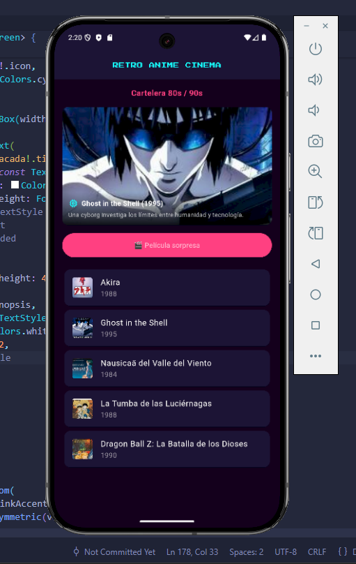
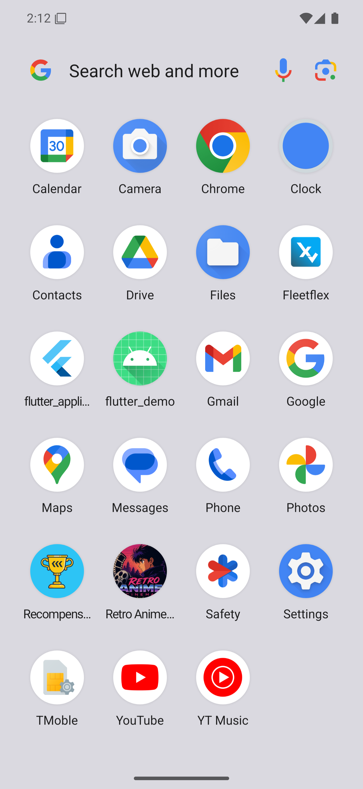
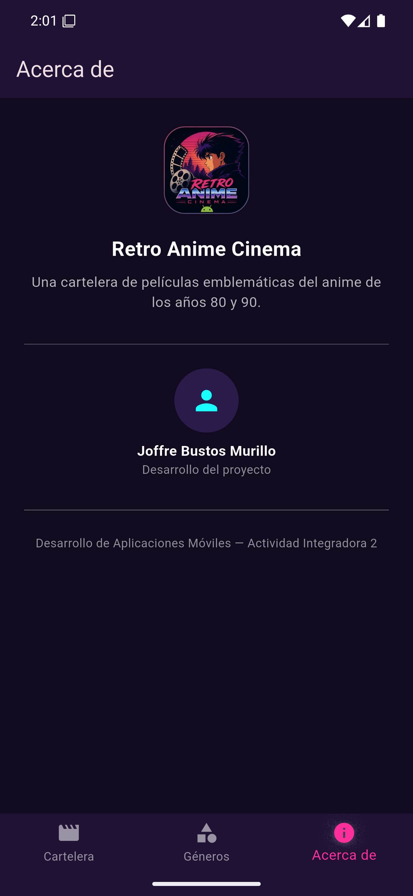
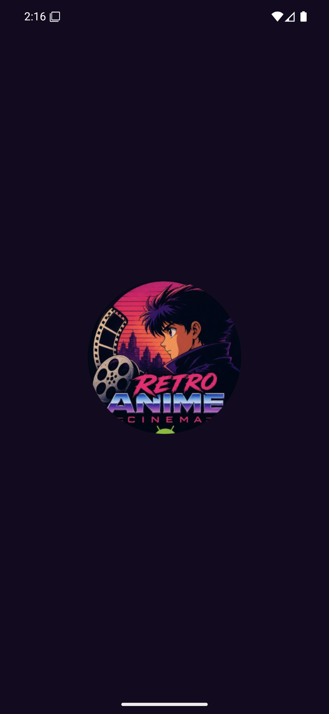
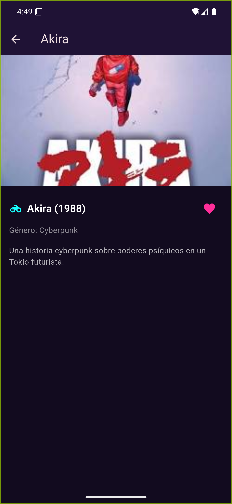
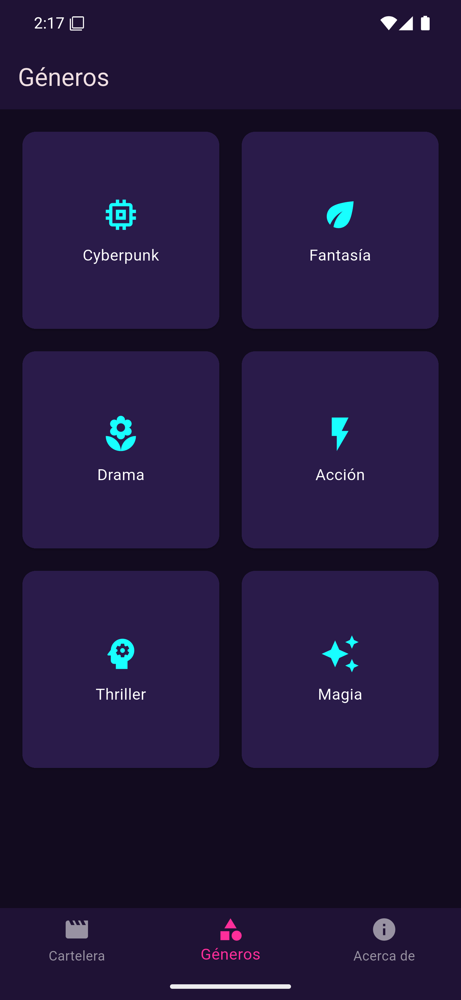
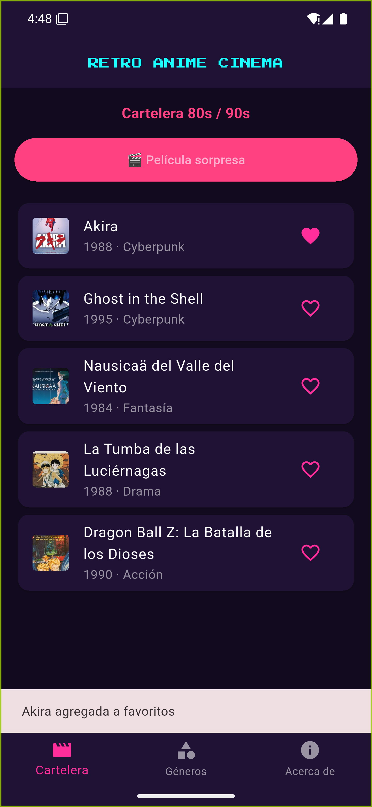
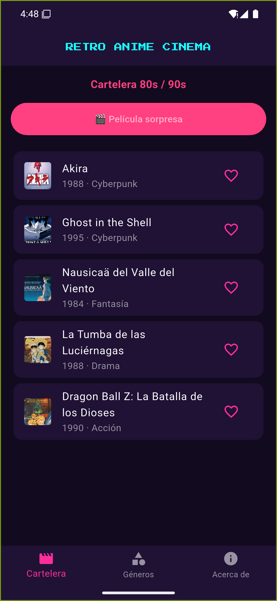

# 🎬 Retro Anime Cinema

Aplicación Flutter. Cartelera de películas de anime clásico de los años 80 y 90.

## Autor
Joffre Bustos Murillo

## Objetivo
Demostrar la creación de un proyecto Flutter, el uso de widgets básicos, la ejecución en un emulador Android, la integración de un paquete externo y la publicación en GitHub.

## Tema elegido
Cartelera de anime — "Retro Anime Cinema": una app que muestra una lista de películas emblemáticas del anime de los 80s/90s (Akira, Ghost in the Shell, Nausicaä, entre otras) con un botón que sortea una "película sorpresa".

## Tecnologías
- Flutter
- Dart
- Paquete externo: [google_fonts](https://pub.dev/packages/google_fonts) — usado para aplicar la tipografía pixelada "Press Start 2P" al título de la app, reforzando la estética retro.

## Widgets utilizados
- `MaterialApp`, `Scaffold`, `AppBar`
- `Column`, `ListView.builder`, `Card`, `Row`
- `Stack`, `Positioned`, `AspectRatio`, `Container` con `BoxDecoration` (degradado tipo banner)
- `Image.asset` para carga de imágenes locales
- `ElevatedButton` con lógica de estado (`StatefulWidget` + `setState`)
- Colores personalizados (paleta neón sobre fondo oscuro)

## Funcionalidad
Al presionar el botón **"🎬 Película sorpresa"**, la app selecciona aleatoriamente una película de la lista y muestra su título, año e ícono en una tarjeta destacada.

## Proceso de desarrollo

1. Verificación del entorno con `flutter doctor`.
2. Creación del proyecto: `flutter create retro_anime_cinema`.
3. Desarrollo de la pantalla principal con la cartelera de películas.
4. Implementación de la interacción del botón (sorteo aleatorio).
5. Instalación e integración del paquete `google_fonts`.
6. Pruebas en emulador Android.
7. Publicación del proyecto en GitHub.
8. Incorporación de imágenes de películas como assets locales y ajuste visual con `Stack` y degradado tipo banner.

## Cómo ejecutar el proyecto

```bash
git clone https://github.com/TU_USUARIO/retro-anime-cinema.git
cd retro-anime-cinema
flutter pub get
flutter run
```

## Evidencias

### Entorno e instalación
| Descripción | Captura |
|---|---|
| `flutter doctor` |  |
| Proyecto en VS Code |  |
| Emulador Android activo |  |
| App ejecutándose |  |
| Instalación del paquete |  |
| pubspec.yaml actualizado |  |

### Aplicación
| Descripción | Captura |
|---|---|
| Pantalla principal |  |
| Botón funcionando |  |
| Uso del paquete google_fonts |  |
| Poster destacado con degradado |  |

### Repositorio
| Descripción | Captura |
|---|---|
| Repositorio en GitHub |  |

---

## Actividad Integradora 2 — Navegación y nuevos widgets

### Descripción breve
Se continuó la aplicación **Retro Anime Cinema** de la Actividad Integradora 1. Se pasó de una sola pantalla a una app con 4 pantallas navegables, organización en carpetas, favoritos persistentes, filtrado por género y personalización visual completa.

### ¿Continuación o app nueva?
Continuación de la app de la Actividad Integradora 1.

### Nuevas funcionalidades
- Navegación entre 4 pantallas mediante `Navigator` y una barra inferior (`BottomNavigationBar`).
- Sistema de favoritos: marcar/desmarcar películas con un ícono de corazón, con persistencia en el dispositivo (sobrevive a cerrar la app).
- Pantalla de géneros: cuadrícula de géneros y, al seleccionar uno, la lista de películas de ese género.
- Reorganización del código en carpetas (`models`, `data`, `theme`, `services`, `screens`, `widgets`) en lugar de un único `main.dart`.
- Personalización de nombre, ícono de launcher, logo y colores.

### Pantallas desarrolladas
1. **Cartelera (Home)** — lista completa de películas, botón de "película sorpresa" y acceso al detalle/favoritos de cada una.
2. **Detalle de película** — imagen grande, año, género, sinopsis completa y botón de favorito.
3. **Géneros** — cuadrícula de géneros (Cyberpunk, Fantasía, Drama, Acción); al tocar uno se muestra la lista filtrada de películas de ese género.
4. **Acerca de** — logo del proyecto, datos del autor y descripción de la app.

### Widgets nuevos utilizados
`GridView`, `CircleAvatar`, `Divider`, `IconButton`, `BottomNavigationBar`, `IndexedStack`, además de los ya usados (`ListView`, `ListTile`, `Card`, `Image`, `Icon`, `ElevatedButton`, `Padding`, `SizedBox`, `Expanded`, `Container`).

### Interacciones implementadas
- Navegación completa entre las 4 pantallas (bottom nav + `Navigator.push`/`pop` al detalle y a los resultados de un género).
- Marcar/desmarcar una película como favorita (ícono de corazón) con confirmación visual mediante `SnackBar`.
- Filtrado de la cartelera al seleccionar un género en la pantalla de Géneros.

### Funcionalidad con `setState()`
El estado de favoritos (un `Set<String>` con los títulos marcados) vive en `RootScreen` (`lib/main.dart`). Al tocar el corazón en cualquier pantalla, `_toggleFavorite()` agrega o quita el título del set con `setState()`, lo que actualiza al instante el ícono en la Cartelera, el Detalle y los resultados de Géneros, y además guarda el cambio en el dispositivo.

### Paquete externo
[`shared_preferences`](https://pub.dev/packages/shared_preferences) — se usa para guardar la lista de películas favoritas en el almacenamiento local del dispositivo (`lib/services/favorites_service.dart`), de modo que los favoritos no se pierdan al cerrar y volver a abrir la app.

### Personalización realizada
- **Nombre de la app**: cambiado a "Retro Anime Cinema" en `AndroidManifest.xml` (Android) e `Info.plist` (iOS).
- **Ícono de launcher**: ícono adaptativo generado con `flutter_launcher_icons` a partir del logo propio, con el fondo del tema (`#120B1F`) en lugar del blanco por defecto.
- **Splash screen**: fondo con el color del tema y logo ampliado (`res/values-v31/styles.xml` y `res/drawable/launch_background.xml`).
- **Logotipo**: imagen `assets/images/logo.png` con la paleta neón del proyecto, mostrada en la pantalla "Acerca de".
- **Colores personalizados**: paleta neón (magenta, cian, morado oscuro) centralizada en `lib/theme/app_theme.dart`.

| Descripción | Captura |
|---|---|
| Nombre e ícono en el launcher |  |
| Logo en pantalla "Acerca de" |  |
| Splash screen personalizado |  |
| Pantalla de detalle de película |  |
| Pantalla de géneros |  |
| Favorito marcado |  |
| Navegación inferior |  |

### Cómo ejecutar el proyecto
```bash
git clone https://github.com/jbustos-ecotec/retro-anime-cinema.git
cd retro-anime-cinema
flutter pub get
flutter run
```
